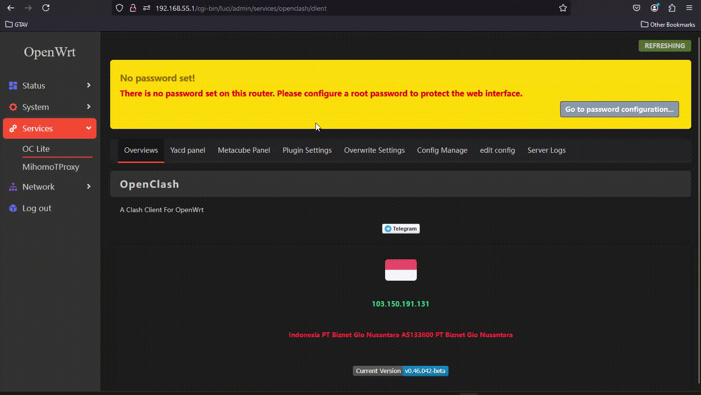
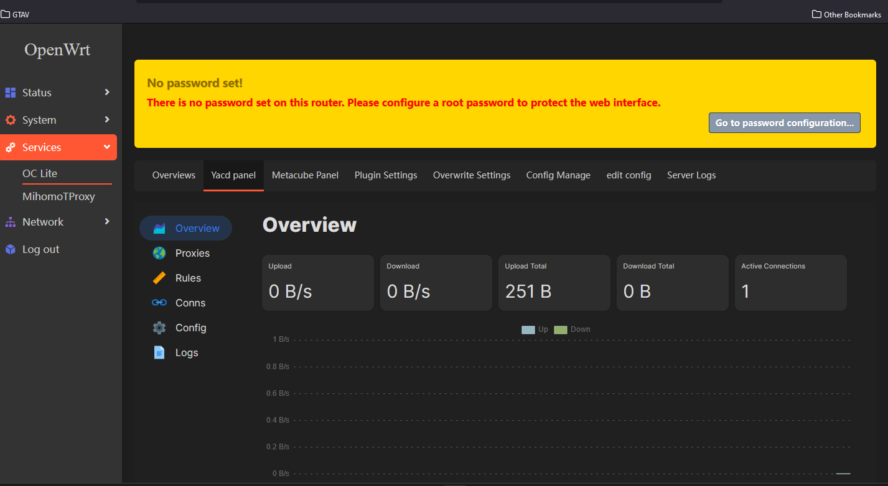
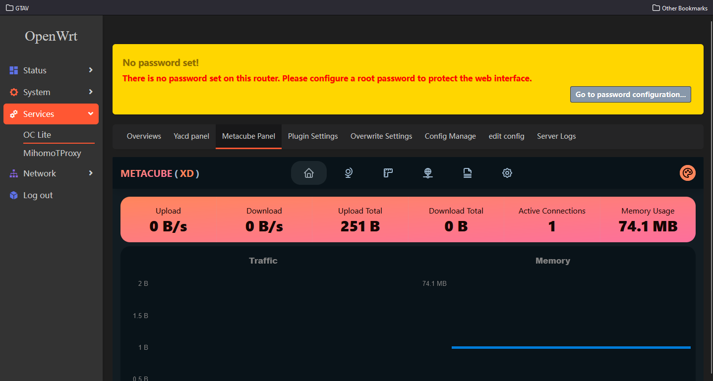
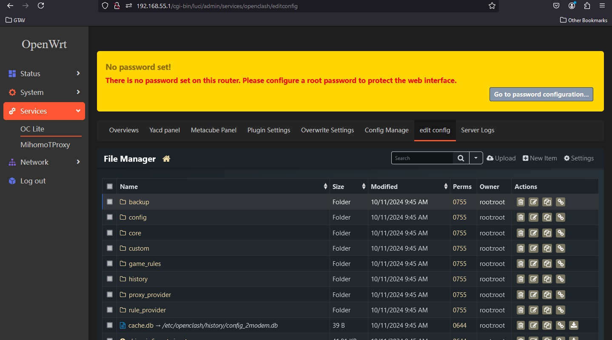

## Openclash lite version

[](README-EN.md)
[](https://github.com/bobbyunknown/OpenClash-lite/releases)
[](https://github.com/bobbyunknown/OpenClash-lite)


#### Telegram group:
[](https://t.me/+TuLCASzJrVJmNzM1)


Original repo dari [@vernesong/OpenClash](https://github.com/vernesong/OpenClash)

### Menambahkan
- Menampilkan IP
- Panel yacd
- Panel metacube
- Panel config editor

### Install
- Install manual silakan download di release
- Auto install
```
bash -c "$(curl -fsSL https://raw.githubusercontent.com/bobbyunknown/OpenClash-lite/refs/heads/main/install.sh)"
```


### Tambahan
Untuk config editor silakan install tinyfm agar berfungsi dengan baik
```
bash -c "$(curl -fsSL https://raw.githubusercontent.com/bobbyunknown/luci-app-tinyfm/refs/heads/main/install.sh)"
```
> **Catatan:** 
> Untuk menggunakan config editor:
> 1. Buka File Manager
> 2. Navigasi ke Config > Symlink > Openclash 
> 3. Buat symlink


Ini adalah versi ringan dari OpenClash, sebuah klien Clash untuk OpenWrt. Beberapa fitur utama:


- Kompatibel dengan protokol Shadowsocks, ShadowsocksR, Vmess, Trojan, dll.
- Menggunakan aturan konfigurasi yang fleksibel untuk proxy strategis


Untuk informasi lebih lanjut, silakan kunjungi repo asli.


Screenshot

### Screenshot






